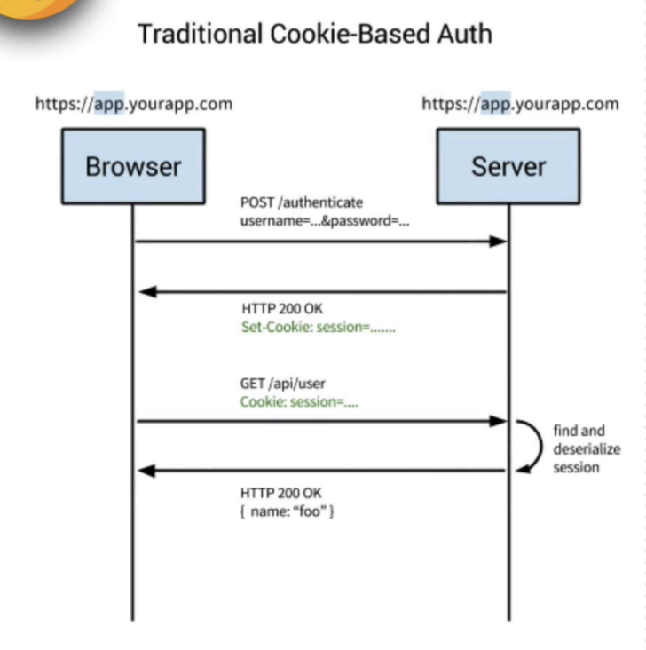

# login-exercise

OAuth2 Login exercise with Passport Google Strategy. Extra security features. Sessions. 
## setup
npm start

go to https://localhost:3000

## Info

- Secured https endpoints with certificate and key from OpenSSL
- Helmet: provides middlewares to secure server from different hacker attacks. For example, it removes some info from headers sent by the server to the client.
- Client side session
- Comments to describe the flow and extra possible features

## Description

